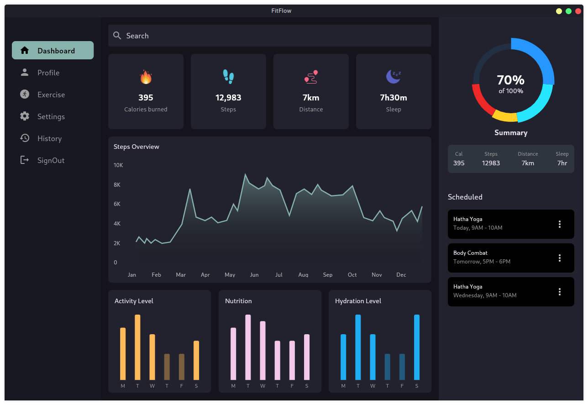
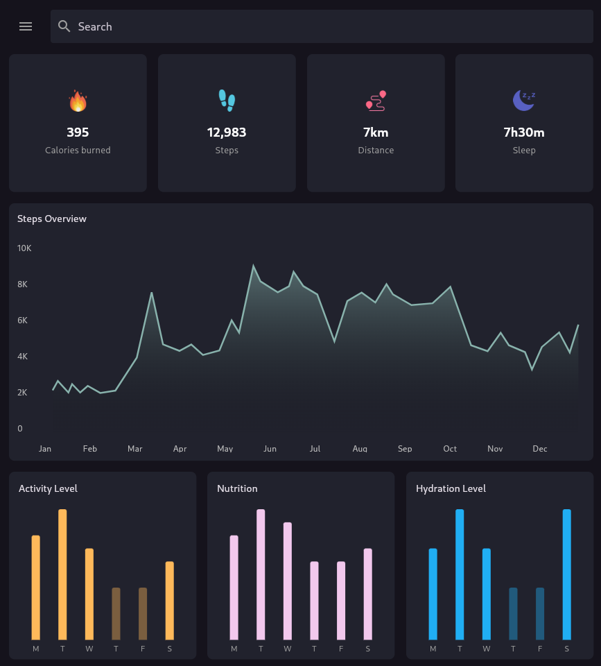
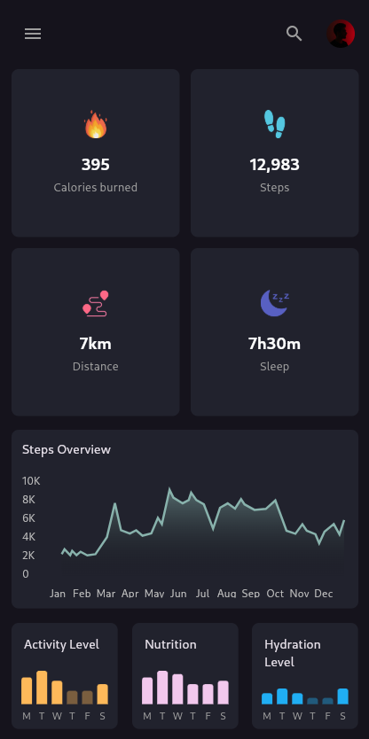

# FitFlow

FitFlow is a fitness tracking Flutter UI that provides a comprehensive dashboard to monitor health data, visualize statistics with interactive charts, and view detailed activity reports. The UI is designed to adjusts seamlessly across mobile, tablet, and desktop devices for an optimal user experience.

## Features

- **Interactive Line and Bar Charts**: Visualize your fitness progress with dynamic graphs.
- **Pie Charts**: Provides a snapshot of fitness data.
- **Responsive Layout**: The app adjusts seamlessly across mobile, tablet, and desktop devices.
- **Side Menu**: A collapsible side navigation menu for easy access to different sections.

## Screenshots

| **Desktop** |
| --- |
|  |

| **Tablet** | **Mobile** |
| --- | --- |
|  |  |

## Getting Started

### Prerequisites

- Flutter SDK [official Flutter website](https://flutter.dev/docs/get-started/install).

### Installation

1. Clone the repository:

   ```bash
   git clone https://github.com/MrMDrX/FitFlow.git
   ```

2. Navigate into the project directory:

   ```bash
   cd FitFlow
   ```

3. Install the dependencies:

   ```bash
   flutter pub get
   ```

4. Run the application:

   ```bash
   flutter run
   ```

## Contributing

We welcome contributions! If you have suggestions or improvements, please open an issue or submit a pull request.

## License

This project is licensed under the MIT License - see the [LICENSE](LICENSE.md) file for details.